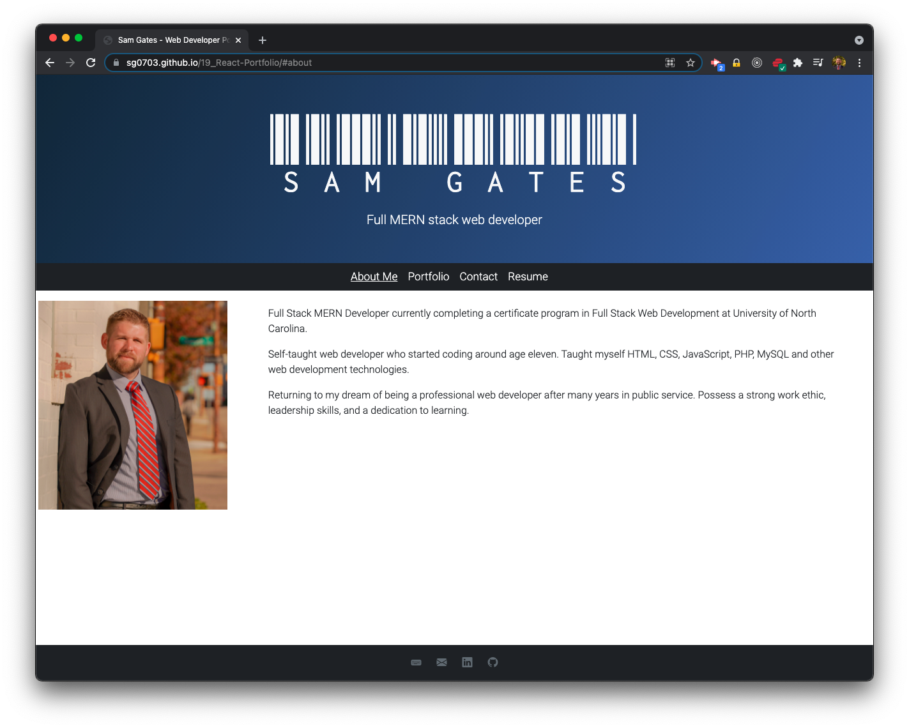
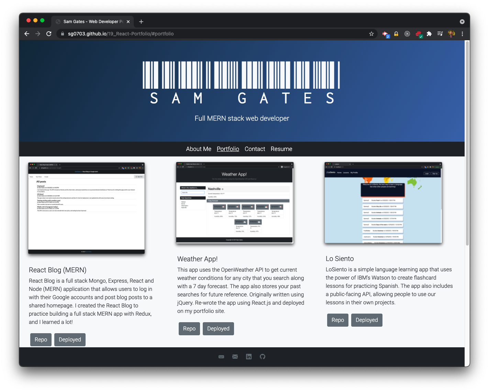
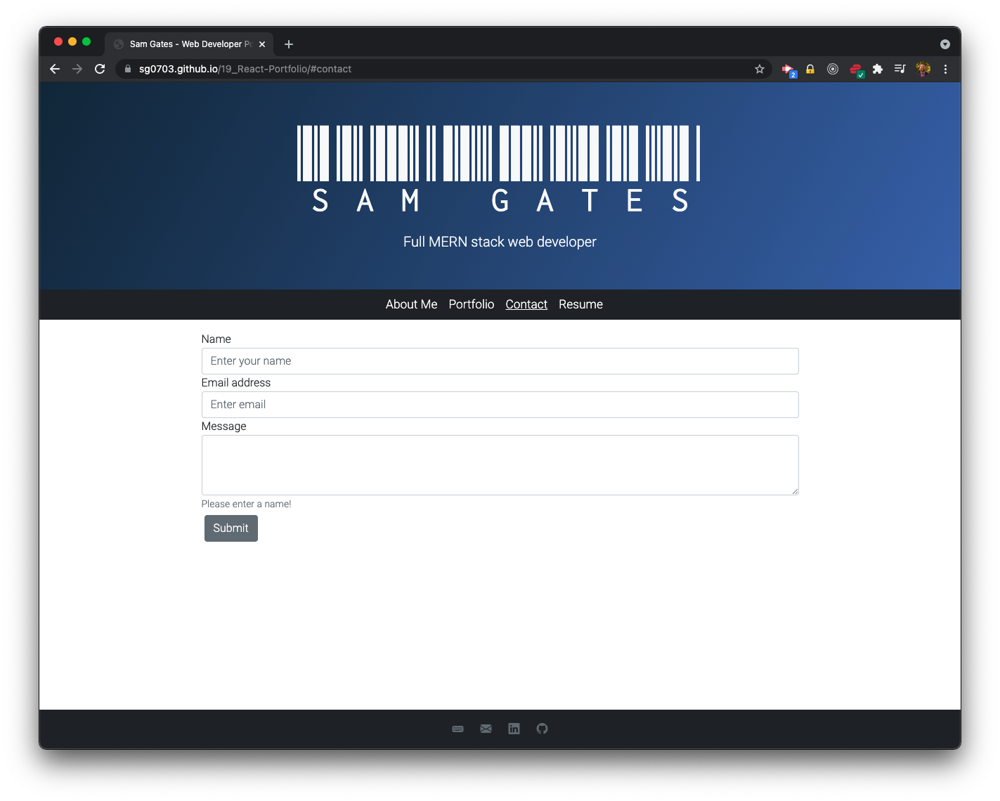

# React Portfolio

## Description

This app is the latest version of my portfolio page. React Portfolio is written using React and was deployed using Github Pages. For styling, I used Bootstrap and custom fonts from Google Fonts. The portfolio features six of my past projects, including two recent side-projects I did involving React and Redux. There is also a link to my resume.

## Deployed

The project is deployed on [GitHub pages](https://sg0703.github.io/19_React-Portfolio/).

## Table of Contents

- [Installation](#installation)
- [Usage](#usage)
- [Contribute](#contribute)
- [Test](#test)
- [License](#license)
- [Questions](#questions)

## Installation

If you would like to see the source code, you can clone the project and run it locally. There is no backend required.

## Usage

You navigate by clicking the different links in the navigation bar.

## Contribute

You can send me an email with suggestions.

## Test

You can test the app by visiting the deployed page [here](https://sg0703.github.io/19_React-Portfolio/).

## License

Copyright (c) Sam Gates. All rights reserved.
Licensed under the [MIT](https://opensource.org/licenses/MIT) license.

## Questions

Check out my [GitHub Profile](https://github.com/sg0703).

Email with questions! You can reach me at sam.j.gates@gmail.com.
